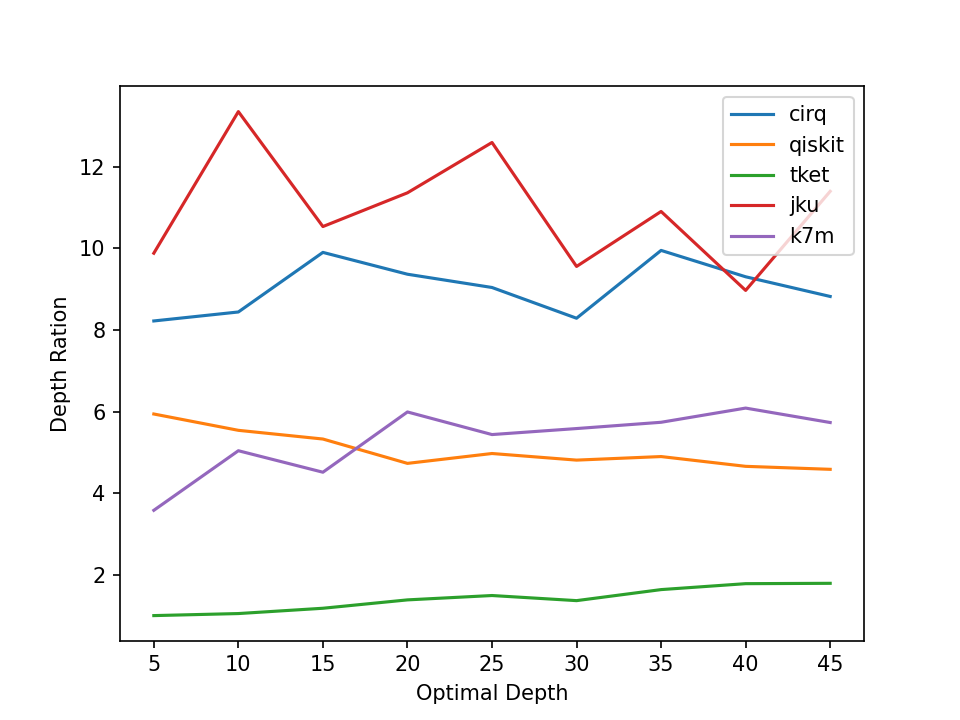

This repo contains the code and results of QXX and QXX-MLP.
```
@article{paler2020machine,
  title={Machine learning optimization of quantum circuit layouts},
  author={Paler, Alexandru and Sasu, Lucian M and Florea, Adrian and Andonie, Razvan},
  journal={arXiv preprint arXiv:2007.14608},
  year={2020}
}
```

A simple usage example can be seen in [main.py](main.py).
The results for benchmarking QXX with 
[arxiv:2002.09783](https://arxiv.org/pdf/2002.09783.pdf) 
are below.




The general idea of is that the initial placement of the qubits influences 
to a great extent the total cost of  compiling a circuit for NISQ. Thus, it 
seems reasonable to:
1) invest more computational power to find an initial placement using a 
lookahead heuristic that estimates as good  as possible the cost of the 
fully mapped circuit;
2) after finalising the initial placement, do not invest too much care and 
computational power to improve the cost of the placement heuristic.


Some concepts used by QXX were presented in a paper about the K7M heuristic
```
@inproceedings{paler2019influence,
  title={On the influence of initial qubit placement during NISQ circuit compilation},
  author={Paler, Alexandru},
  booktitle={International Workshop on Quantum Technology and Optimization Problems},
  pages={207--217},
  year={2019},
  organization={Springer}
}
```

PS: QXX has this name for no particular reason.
PS: The name of the K7M heuristic is borrowed from the 
[Renault engine](https://en.wikipedia.org/wiki/Renault_K-Type_engine).